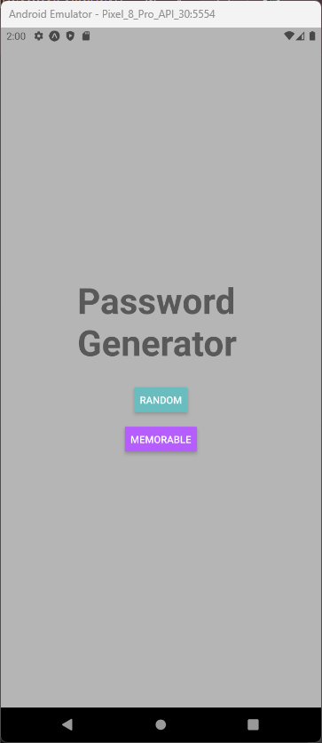
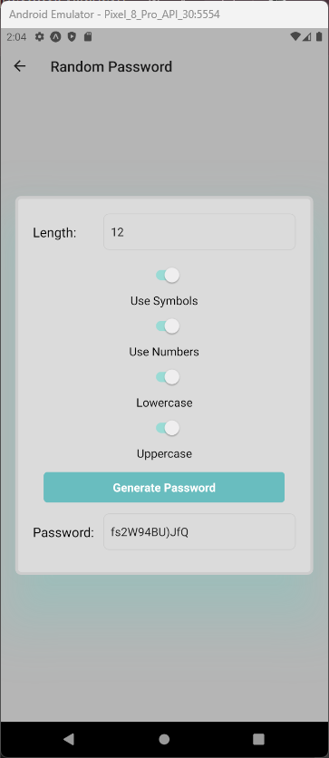
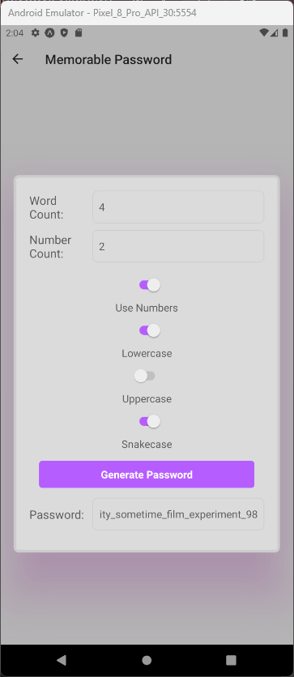

# myPassword

myPassword is an application for providing users with a random highly secured password!
This app features the ability to customize the type of password generated. You can choose between a random characterized password with letters, numebers and symbols or a password with randomly assorted words merged with snake_case or number options.

Below are screenshots of the app along with a demo video:

https://github.com/user-attachments/assets/bef487d8-ef33-4957-a22a-6788a96b98ff

https://github.com/user-attachments/assets/5d258165-893d-45ce-aa21-a61368c3bd8c

## Libraries used:
expo
react-navigation/native
react-navigation/stack

How to Run:

1. Clone repo
2. Npm install
3. Npm run android or Npm run ios
